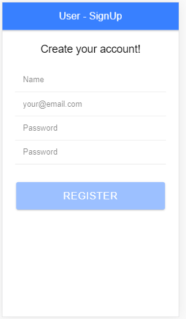
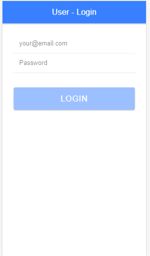
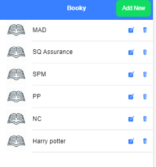
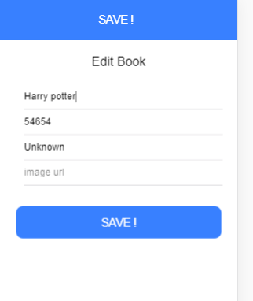
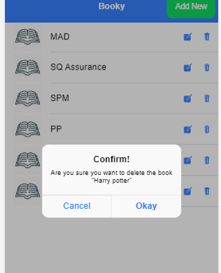

### Service provider and Job seeker (Worker)
### Hybrid mobile application, provide services on daily rutin works.
### Users can simply post his damaged house hold parts of good where 
### a worker will complete his legal work.
### this repository contains Front end of application in ionic/angular
### Application start with different work categories.

### Next it prompts pictures to be uploaded on upload care

### post work button enabled

### images uploaded to uploadcare

### image url stored to firestore along side with image discription

### firestore collection with uids

### Displaying all posts

### connected to service provider backend 
### login and sign up actions performed
### SignUp page

### signUp successfull

### login page

### login successfull

### User can load all books, delete, edit and add only if loged in
### User is login
### load all books

### book added

### Edit book

### delete book

### Responses from backend in browsers

