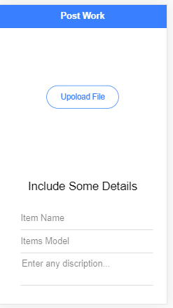
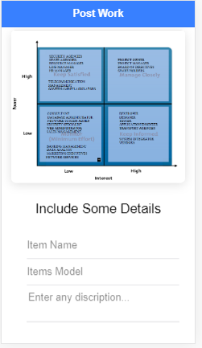
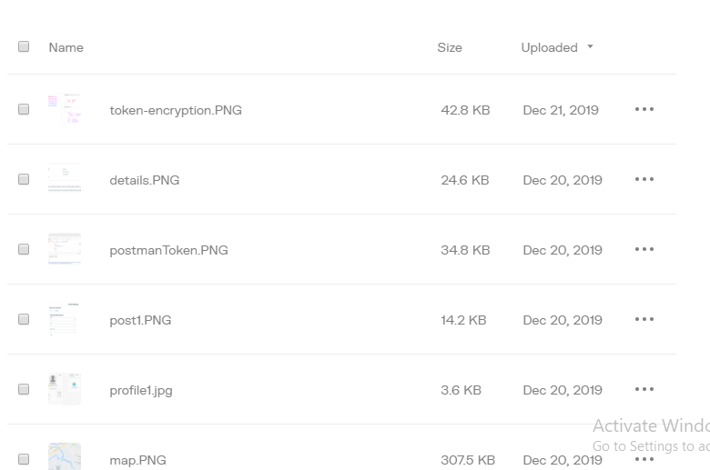
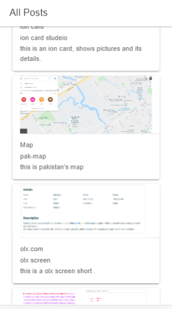

### Service provider and Job seeker (Worker)
### Hybrid mobile application, provide services on daily rutin works.
### Users can simply post his damaged house hold parts of good where 
### a worker will complete his legal work.
### this repository contains Front end of application in ionic/angular
### Application start with different work categories.

### Next it prompts pictures to be uploaded on upload care

### image url stored to firestore along side with image discription

### Displaying all posts

